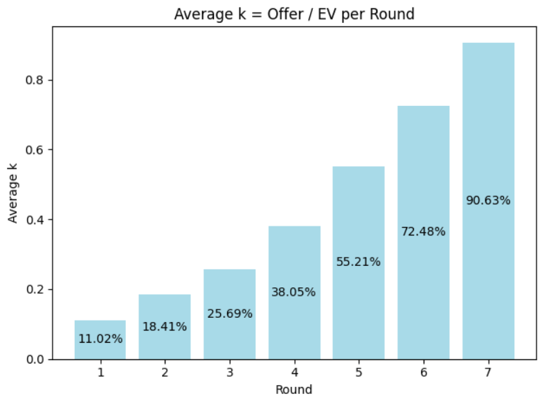
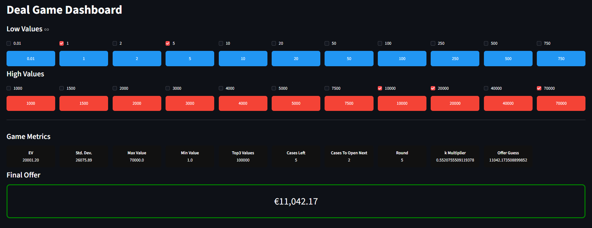

This is an application that runs Streamlit to illustrate a **Deal dashboard**.

Under the `src` folder, you can find the following sub-folders, named:
* `app` or `ui` for the Python code that is related to the Streamlit Dashboard.
* `core` for the Python code that is related to the actual functionalities and calculations that take place inside the project.
* `tests` that contains predefined Streamlit-based code that can be found in their official webpage: `https://streamlit.io/playground`.

# Easy Setup

After downloading the repo (e.g., as a ZIP file) under a directory of your choice, navigate under the main project folder `deal`, which is the root of the project. For both Linux and Windows, create a venv by running:

```
python -m venv venv
```

To activate the virtual environment, run:

### Linux

```
source venv/bin/activate
```

### Windows PowerShell

```
.\venv\Scripts\Activate.ps1
```

Then, having activated the virtual environment, run:

```
pip install -e .
```

The repo consists of two main functions that deal with the `k` factor of a Deal Game. `k` is defined as the ratio of the banker's actual offer to the Expected Value, it is, the average of the remaining values. So, `k = Offer / EV`.

# 1. Run `src/core/main.py`

This function constructs two diagrams and outputs the findings of my analysis in the console. It can be run with combining the module `-m` flag after the `python` command, since we have installed the project in editable install mode (`pip install -e .`).

* The first diagram depicts the progressing value of `k` for multiple historical games.
* The second diagram is a barplot that shows the average `k` value per round based on the input historical games.

To verify that the code is correct, just run the following command:

```
python -m deal.core.main
```

The second diagram should look like this:



# 2. Run `src/app/main.py`

This function creates a simple web server under the default Streamlit port 8501, by running the command `streamlit run`. We had better provide the full path of the file rather than the module path. So, in order to experiment with the Deal Game Dashboard, just run:

```
streamlit run .\src\deal\app\main.py
```

By checking and unchecking the case values that are still in the game, a banker's offer that is represented as `offer = k_prediction * EV` is calculated finally. In `http://localhost:8501/`, you should see something like this:

